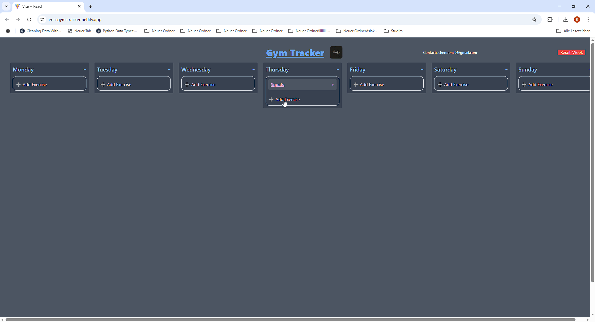

# 🏋️‍♂️ Gym Tracker

A simple, lightweight weekly gym progress tracker. Designed to help users log daily exercises and weights without needing an account or database (data stays in the browser; privacy-focused by default).

🟢 Live (Frontend only) : [https://eric-gym-tracker.netlify.app](https://eric-gym-tracker.netlify.app)

---

## 🖼️ Demo

Here’s how it looks in action:

---

## 📌 Features

- Weekly calendar view with editable weight entries per day.
- Add multiple exercises per day, each with its own name and weight.
- **Collapsible exercise list per day** — toggle visibility to keep the interface clean.
- Responsive design supporting screens **250 pixels wide and above**, with custom Tailwind breakpoints for fine layout control (notably between 1536px and 1773px)
- Reset week button clears all current progress (non-persistent).
- **Planned in 2.0 Version**: Progress analytics with charts for **dummy data** only.

## 🚀 How It Works and Disclaimers

- Built with **React** and simple HTML/CSS.
- User data (exercise name and weight per day) is stored in the browser's `localStorage`.
- Full-stack setup (for learning purposes): Includes a FastAPI backend, Docker setup, and a CI/CD workflow. The backend is **not connected in the live demo**; only frontend data is used.
-The live demo hosted on Netlify **does not collect or transmit any user data**; all entries are saved locally in the browser, **accessible only on the device used**, and are not sent to a backend or stored elsewhere.

## 💼 Note to Recruiters

This is my **first frontend project**, created as a learning exercise to understand React, browser storage, and UI design. While basic in functionality, it's actively being expanded and serves as the foundation for more advanced full-stack and dev-ops features. I'm focused on writing clean, modular code and gradually improving UX responsiveness and visual consistency.

## 🛠️ Tech Stack

- React, JavaScript, HTML/CSS, Tailwind (Frontend)
- Python (FastAPI), Docker (docker-compose) , GitHub Actions CI/CD (Backend / DevOps experiments)
- LocalStorage (Data storage)

## 📱 Responsiveness

This app is responsive for screens **250 pixels wide and above**.

- Input fields, buttons, and text dynamically resize and reposition to maintain usability on various device sizes.
- Wrapping of elements is enabled where necessary to avoid overflow while keeping the UI clean and accessible.
- Important action buttons adapt by showing icons only in tighter layouts to save space and prevent awkward line breaks.
- Custom Tailwind CSS breakpoints provide precise control over layout adjustments, especially between **1536px and 1773px**.

## 📋 License

This project is licensed under the **Apache 2.0 License** — see `LICENSE` for details.

---

## 💡 Development Notes

> This project was intentionally designed as a **frontend-only application**.  
> User data is stored locally in the browser via `localStorage` — no backend or external server is used.  
>
> For learning purposes, I experimented with a **Dockerized FastAPI backend** and **GitHub Actions CI/CD workflows**.  
> However, due to privacy considerations, a persistent backend is **not planned** for this project or may be simulated with **dummy data**.  
>
> Future work will instead focus on **UI/UX improvements** and frontend optimizations.
